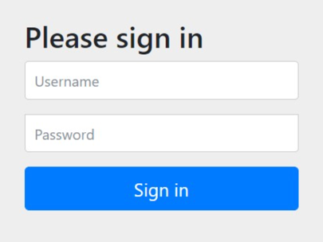
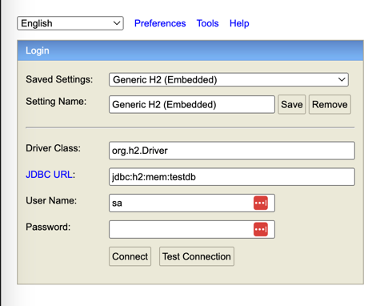

# ReleaseManager

<h2>Built with</h2>
Kotlin: 1.9.24 
Maven: 3.9.2  
SpringBoot: 3.3.2 

<h2>To start the application</h2>

- cd into the release_manager folder
- run mvn clean install  
- run ReleaseManagerApplication 

<h2>Useful links:</h2>
When accessing either of the following links you will likely be prompted for credentials:

The credentials are stored in the application.properties file to be used while running locally,
in production actual credentials should be injected on deployment

Credentials:

- Username: user
- Password: password

<h2>Swagger UI</h2>

- Swagger Ui: http://localhost:8080/swagger-ui/index.html
  <h2>H2 Database</h2>

- In memory H2 DB console: http://localhost:8080/h2-console

H2 DB Console credentials: 

- url: jdbc:h2:mem:testdb 
- username: sa 

<h2>Todo</h2>
- Redis cache to store expensive queries and system version number 
- Kafka to store inbound and deployed services messages to add an additional layer of resiliency 